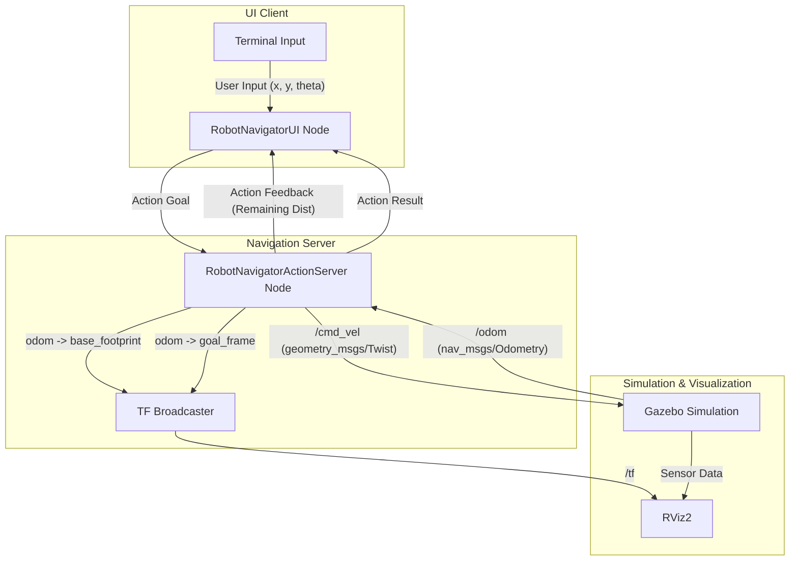

# ROS 2 Custom Navigation Stack

This project implements a custom navigation stack in ROS 2 using an Action Server-Client architecture. It allows a differential drive robot (simulated in Gazebo) to navigate to a target coordinate `(x, y, theta)` while providing real-time feedback and visualization in RViz.

## 🎥 Result Demonstration

Below is the demonstration of the robot successfully navigating to the commanded goal, with both the robot and the goal frame visualized correctly in RViz:


## 🏗️ Architecture

The system is built on a modular ROS 2 architecture, utilizing an Action Server for the navigation logic and an Action Client for the User Interface.



### Custom Action Interface (`Mapstogoal.action`)

The communication between the UI and the Navigation Server is defined by a custom action interface. It encapsulates the goal coordinates, the final result, and the continuous feedback.

```text
# Goal
float32 goal_coord_x
float32 goal_coord_y
float32 goal_theta
---
# Result
bool reached
---
# Feedback
float32 remaining_dist_x
float32 remaining_dist_y 
float32 remaining_theta
```

### Components Details:

1. **`RobotNavigatorUI` (Action Client):**
   - Runs an interactive terminal loop on a detached thread.
   - Accepts `(x, y, theta)` target coordinates or a `cancel` command from the user.
   - Sends the goal asynchronously to the navigation action server.
   - Displays real-time feedback (remaining distance) and the final result (Success/Aborted/Canceled).

2. **`RobotNavigatorActionServer` (Action Server):**
   - Receives the target goal and begins a multi-phase navigation loop (position alignment -> orientation alignment).
   - Subscribes to `/odom` to track the robot's current pose.
   - Publishes velocity commands to `/cmd_vel` to drive the robot.
   - **TF Broadcasting:** Dynamically bridges the TF tree by broadcasting `odom` -> `base_footprint` based on odometry, and continuously broadcasts the `goal_frame` so it can be monitored in RViz.

3. **Gazebo & RViz:**
   - Gazebo runs the `mogi_bot` model, providing physical simulation and sensor bridging (`ros_gz_bridge`).
   - RViz visualizes the robot model, the odometry frame, and the dynamically updating goal frame.

## 🚀 How to Run

1. **Build the workspace:**
   ```bash
   colcon build --packages-select rt2_action_nav bme_gazebo_sensors
   source install/setup.bash
   ```

2. **Launch the Simulation and Nodes:**
   ```bash
   ros2 launch rt2_action_nav all.launch.py
   ```
   *(This will start Gazebo, RViz, the Robot State Publisher, and the Action Server)*

3. **Send a Goal:**
   Once the UI prompts you in the terminal, enter your desired coordinates, or whether you want to cancel the goal:
   ```text
   Enter target coordinates (x y theta), 'cancel' to cancel goal, or 'exit' to quit:
   2.0 1.5 1.57
   ```
